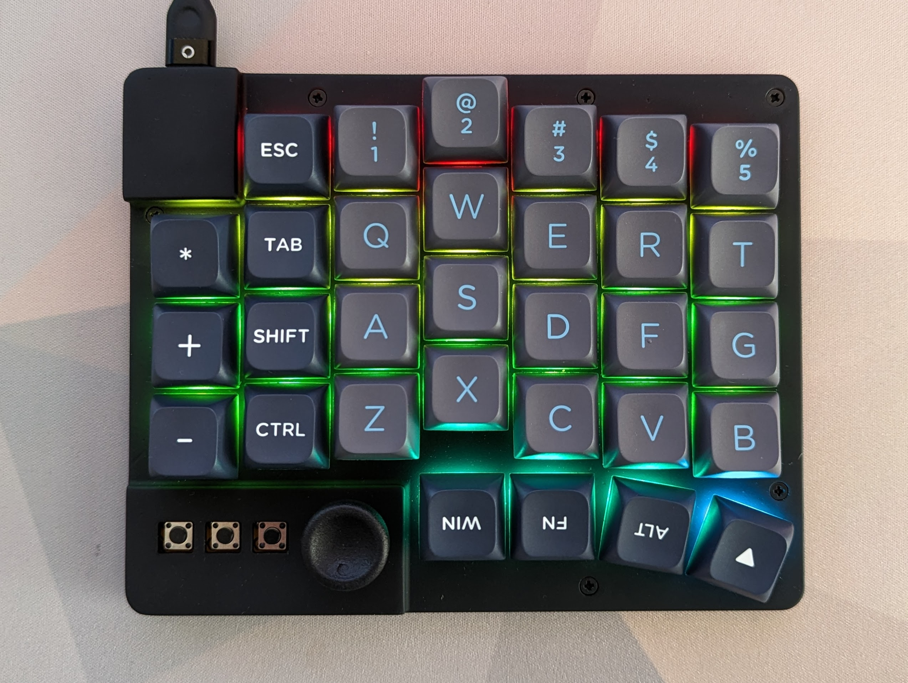
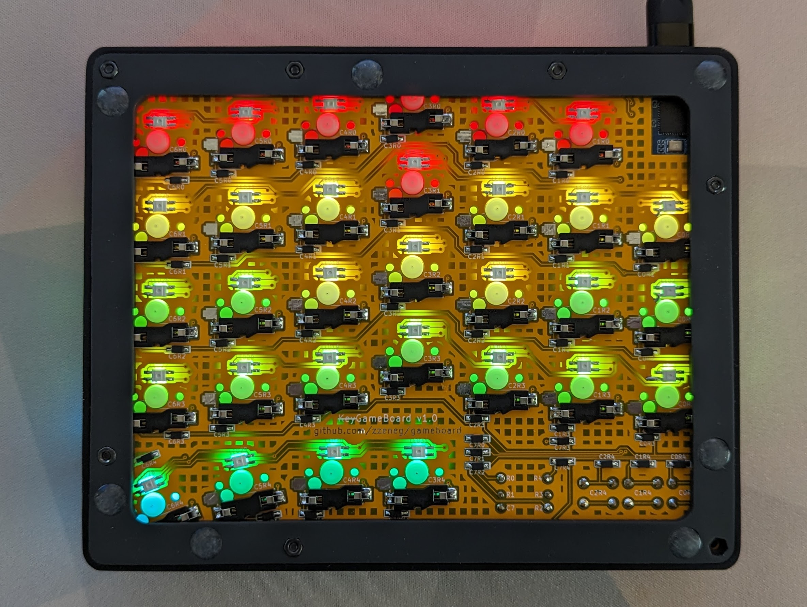
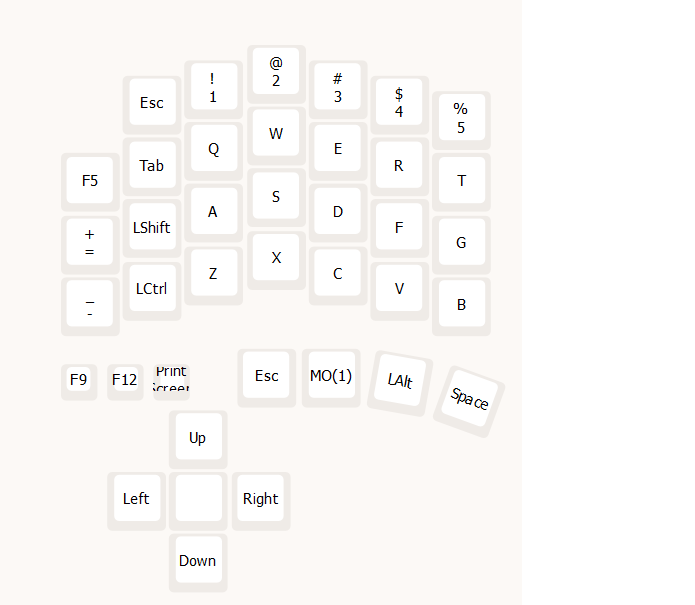
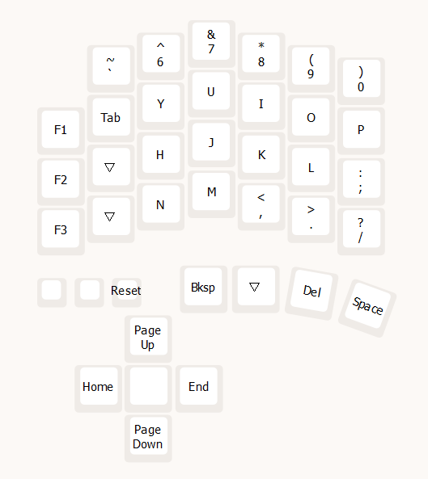
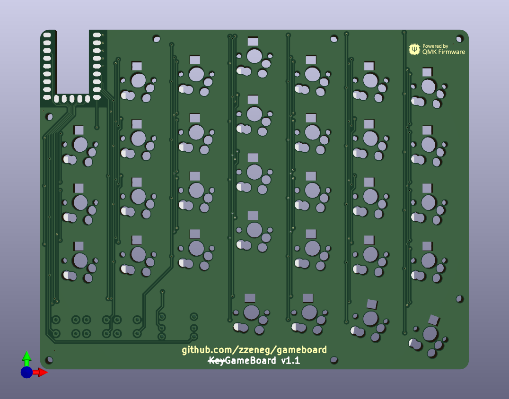
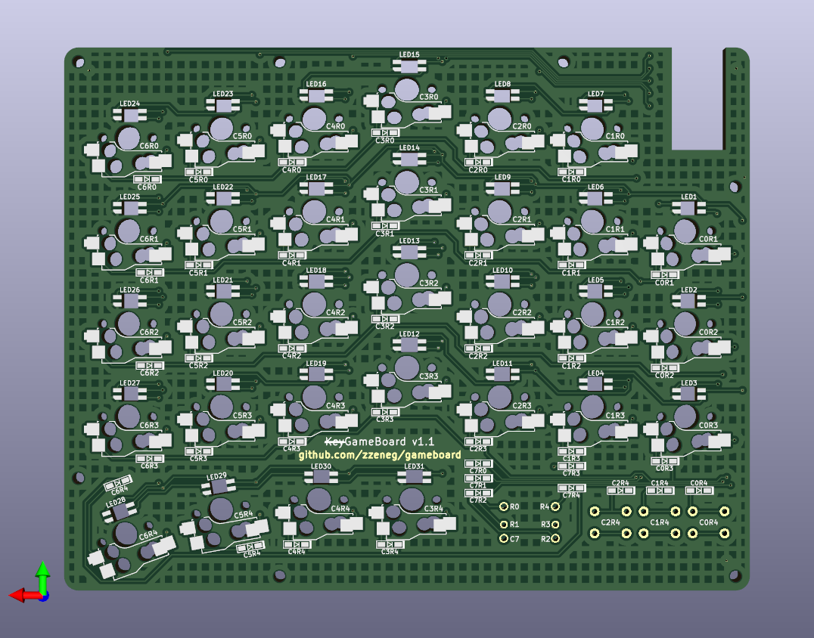

# gameboard

Half-keyboard optimized for gaming.

## Features

- 31 regular MX or KS-33/27 switches
- 5-way switch
- 3 push buttons
- per-key LEDs
- 3D printed case

## Photos

 

## Layout

Optimized for regular WASD setup similar to a normal keyboard, to avoid (or at least minimize) remapping keys for games.

No layer-tap and mod-taps to avoid conflicts (many games require mod presses or holding alpha keys).

1 additional layer to access missing half of keyboard.

Anyway it's easy to change keys on the fly with VIAL.
 

## Case

Tested on JLCPCB resin printing, it may be a bit tight for FDM.

- [KS-33 Top](./case/top.stl)
- [MX Top](./case/top-mx.stl)
- [Bottom](./case/bottom.stl)
- [5-way knob](./case/5way-short.stl) - lower profile knob, if you want higher profile check out ones from [@sadekbaroudi](https://github.com/sadekbaroudi/fingerpunch/tree/master/3d-models/5-way-tactile-switch-knobs)

## Gerber files

- [PCB](./pcb/production/pcb.zip)

## VIAL firmware

- [source code](https://github.com/zzeneg/vial-qmk/tree/feature/zzeneg/keyboards/gameboard)
- [pre-compiled file](https://github.com/zzeneg/vial-qmk/releases/download/zzeneg/gameboard_vial.uf2)

## Bill of materials

- PCB
- 3D printed parts (top, bottom, knob)
- Waveshare [RP2040 Zero](https://www.aliexpress.com/item/3256804090654134.html) MCU
- 39 [SMD SOD-123 1N4148](https://www.aliexpress.com/item/1005002882901030.html) diodes
- 1 [5way switch](https://www.aliexpress.com/item/4000681560472.html)
- 3 [push buttons](https://www.aliexpress.com/item/32912263133.html) - default height is 4.3mm but you can use 6-8mm if you want easier access to them
- 31 [RGB LEDs](https://www.aliexpress.com/item/1005003636607308.html)
- [M2 screws with flat head](https://www.aliexpress.com/item/4001248931159.html) - 8mm for MX or 8mm+6mm for KS
- [M2 nuts](https://www.aliexpress.com/item/1005001412230125.html)
- [7x1.5 legs](https://www.aliexpress.com/item/1005002995402961.html)

## Build guide

Please see my [stront guide](https://github.com/zzeneg/stront/blob/main/build-guide/choc/readme.md) for detailed instructions on soldering diodes/LEDs/sockets/MCU.

## Development

For proper KiCad setup install my [zzkeeb](https://github.com/zzeneg/zzkeeb/blob/main/README.md#installation) library

## Support

If you like my work and want to support my future designs, please consider [sponsorship](https://github.com/sponsors/zzeneg).
